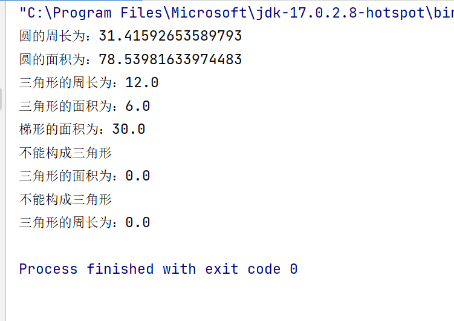
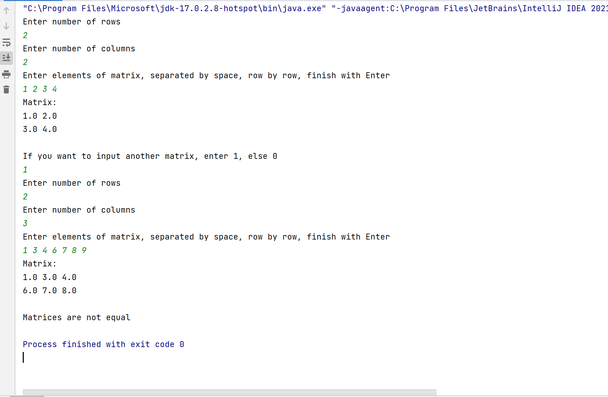

# 面向对象抽象设计初步实验报告
```
兰州大学信息科学与工程学院 徐宇奇 320190902531
```
## 第一部分 验证试验
### 1.1 第一题
#### 封装的意思是
```
封装是将数据和代码捆绑到一起，对象的某些数据和代码可以是私有的，不能被外界访问，
以此实现对数据和代码不同级别的访问权限。防止了程序相互依赖性而带来的变动影响，
面向对象的封装比传统语言的封装更为清晰、更为有力。有效实现了两个目标：
对数据和行为的包装和信息隐藏。
```
#### "p1=new Person("张三”,28,'M');"的含义和作用是
```
p1=new Person("张三”,28,'M');
新建对象p1，p1.name设置为张三，p1.age设置为28，
p1.sex设置为M
```
#### "p2.setName("陈红");"的作用是
```
设置p2的name为陈红
```
### 1.2 第二题
#### Java数组和C语言数组的区别是
```
Java数组可以定义为动态数组，C语言数组不可以
在 C 中，字符串通常只是一个字符数组（或一个指针），以 NUL (\0) 字符结尾。 
可以像处理任何数组一样处理字符串。 
然而，在 Java 中，字符串不是数组。 Java 字符串是 java.lang.String 类的实例（对象）。 
它们代表字符数据，但内部实现不暴露
不能将它们视为数组，
但如果需要，您可以将字符串数据提取为字节或字符数组（方法 getBytes 和 getChars）。 
Java 字符始终为 16 位，而 C 中的字符通常（不总是）为 8 位。
```
#### 试解释"b=new Person[3];"语句和"b[0]=new Person("张三",28,'M');"语句的作用，以及他们之间的区别和联系
```
新建一个长度为3的Person数组b，
b[0]=new Person("张三",28,'M');
b[0]是新建的Person对象，b[0].name设置为张三，b[0].age设置为28，b[0].sex设置为M
联系：先建立对象数组，后在对象数组中新建对象
```
## 第二部分 填空实验
### 2.1 第一题
代码如下：
```Java
package lesson2;
class Triangle {
    double sideA, sideB, sideC,area,length;
    boolean flag;
    public Triangle(double sideA, double sideB, double sideC) {
        if(sideA+sideB>sideC && sideA+sideC>sideB && sideB+sideC>sideA){
            this.sideA = sideA;
            this.sideB = sideB;
            this.sideC = sideC;
            flag = true;
        }else{
            flag = false;
        }
    }
    public double getLength() {
        if(flag){
            length = sideA+sideB+sideC;
            return length;
        }else{
            System.out.println("不能构成三角形");
            return 0;
        }
    }
    public double getArea() {
        if(flag){
            double p = (sideA+sideB+sideC)/2;
            area = Math.sqrt(p*(p-sideA)*(p-sideB)*(p-sideC));
            return area;
        }else{
            System.out.println("不能构成三角形");
            return 0;
        }
    }
    public void setABC(double sideA, double sideB, double sideC) {
        if(sideA+sideB>sideC && sideA+sideC>sideB && sideB+sideC>sideA){
            this.sideA = sideA;
            this.sideB = sideB;
            this.sideC = sideC;
            flag = true;
        }else{
            sideA=sideB=sideC=0;
            flag = false;
        }
    }
}
class Lader{
    double above,bottom,height,area;
    Lader(double above, double bottom, double height){
        this.above = above;
        this.bottom = bottom;
        this.height = height;
    }
    public double getArea(){
        area = (above+bottom)*height/2;
        return area;
    }
}
class Circle{
    double radius,area;
    Circle(double radius){
        if(radius>0) {
            this.radius = radius;
        }
    }
    double getArea(){
        area = Math.PI*radius*radius;
        return area;
    }
    double getLength(){
        return 2*Math.PI*radius;
    }
    void setRadius(double newRadius){
        if(radius>0) {
            this.radius = newRadius;
        }
    }
    double getRadius(){
        return radius;
    }
}
public class AreaAndLength {
    public static void main(String[] args) {
        double length,area;
        Circle circle=null;
        Triangle triangle=null;
        Lader lader=null;
        circle = new Circle(5);
        triangle = new Triangle(3,4,5);
        lader = new Lader(4,8,5);
        length = circle.getLength();
        System.out.println("圆的周长为："+length);
        area = circle.getArea();
        System.out.println("圆的面积为："+area);
        length = triangle.getLength();
        System.out.println("三角形的周长为："+length);
        area = triangle.getArea();
        System.out.println("三角形的面积为："+area);
        area = lader.getArea();
        System.out.println("梯形的面积为："+area);
        triangle.setABC(12,34,1);
        area = triangle.getArea();
        System.out.println("三角形的面积为："+area);
        length = triangle.getLength();
        System.out.println("三角形的周长为："+length);
    }
}
```
运行结果如下：

##第三部分 设计实验
代码如下
```Java
package lesson2;


import java.util.Scanner;

import static java.lang.System.exit;

public class Matrix {
    private float[][] matrix;
    private int rows;
    private int columns;

    public Matrix(int rows, int columns) {
        this.rows = rows;
        this.columns = columns;
        matrix = new float[rows][columns];
    }

    public int getRows() {
        return rows;
    }

    public int getColumns() {
        return columns;
    }

    public float getElement(int row, int column) {
        return matrix[row][column];
    }

    public void setElement(int row, int column, float value) {
        matrix[row][column] = value;
    }

    public void print() {
        for (int i = 0; i < rows; i++) {
            for (int j = 0; j < columns; j++) {
                System.out.print(matrix[i][j] + " ");
            }
            System.out.println();
        }
    }

    public static int inputInt() {
        Scanner scanner = new Scanner(System.in);
        if (scanner.hasNextInt()) {
            return scanner.nextInt();
        } else {
            System.out.println("Incorrect input");
            exit(0);
            return 0;
        }
    }

    public float[][] inputFloats(int row, int column) {
        Scanner scanner = new Scanner(System.in);
        float[][] matrix = new float[row][column];
        String[] str;
        str = scanner.nextLine().split(" ");
        for (int i = 0; i < row; i++) {
            for (int j = 0; j < column; j++) {
                try {
                    matrix[i][j] = Float.parseFloat(str[i * column + j]);
                } catch (NumberFormatException e) {
                    System.out.println("Incorrect input in row " + i + " column " + j);
                    exit(0);
                }
            }
        }
        return matrix;
    }

    public float inputFloat() {
        Scanner scanner = new Scanner(System.in);
        if (scanner.hasNextFloat()) {
            return scanner.nextFloat();
        } else {
            System.out.println("Incorrect input");
            exit(0);
            return 0;
        }
    }

    public boolean isEqual(Matrix matrix1, Matrix matrix2) {
        if (matrix1.getRows() != matrix2.getRows() || matrix1.getColumns() != matrix2.getColumns()) {
            return false;
        }
        for (int i = 0; i < matrix1.getRows(); i++) {
            for (int j = 0; j < matrix1.getColumns(); j++) {
                if (matrix1.getElement(i, j) != matrix2.getElement(i, j)) {
                    return false;
                }
            }
        }
        return true;
    }
    public String toString(Matrix matrix){
        String str = "";
        for (int i = 0; i < matrix.getRows(); i++) {
            for (int j = 0; j < matrix.getColumns(); j++) {
                str += matrix.getElement(i, j) + " ";
            }
            str += "\n";
        }
        return str;
    }

    public static void main(String[] args) {
        System.out.println("Enter number of rows");
        int rows = inputInt();
        System.out.println("Enter number of columns");
        int columns = inputInt();
        Matrix matrix = new Matrix(rows, columns);
        System.out.println("Enter elements of matrix, separated by space, row by row, finish with Enter");
        matrix.matrix = matrix.inputFloats(rows, columns);
        System.out.println("Matrix:");
        System.out.println(matrix.toString(matrix));
        System.out.println("If you want to input another matrix, enter 1, else 0");
        switch (matrix.inputInt()) {
            case 1:
                System.out.println("Enter number of rows");
                rows = inputInt();
                System.out.println("Enter number of columns");
                columns = inputInt();
                Matrix matrix1 = new Matrix(rows, columns);
                System.out.println("Enter elements of matrix, separated by space, row by row, finish with Enter");
                matrix1.matrix = matrix1.inputFloats(rows, columns);
                System.out.println("Matrix:");
                System.out.println(matrix1.toString(matrix1));

                if (matrix.isEqual(matrix, matrix1)) {
                    System.out.println("Matrices are equal");
                    exit(0);
                } else {
                    System.out.println("Matrices are not equal");
                    exit(0);
                }
                break;
        }
    }
}
```
运行结果如下

设计思路：

