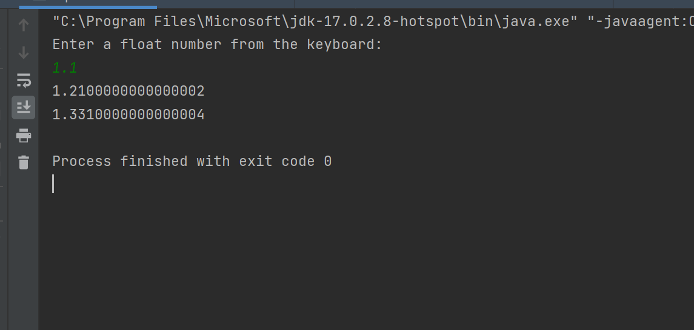
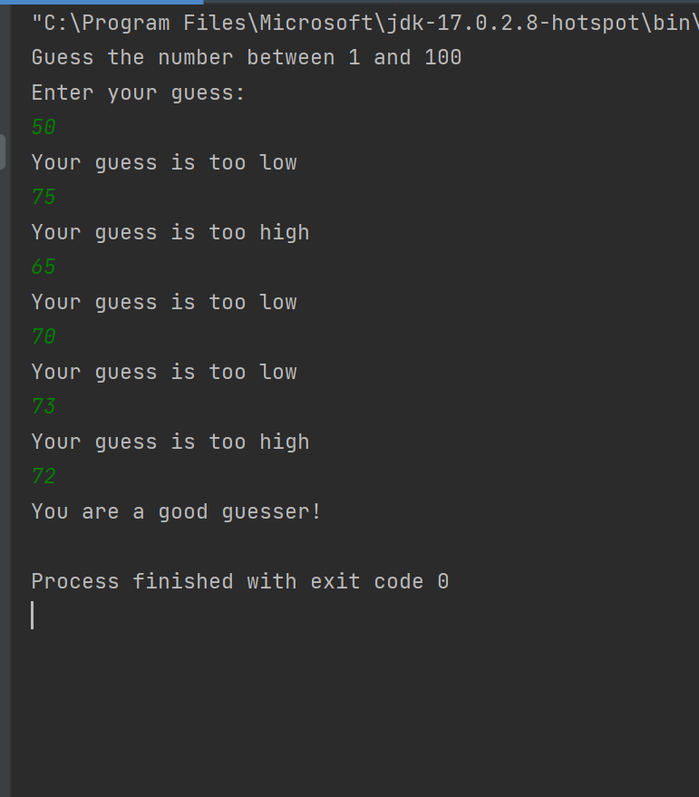
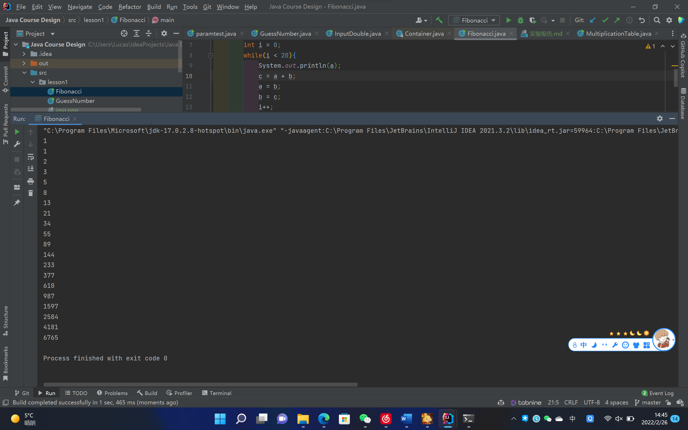

# 流程控制实验报告

```
兰州大学信息科学与工程学院 徐宇奇 320190902531
```

## 第一部分

### 1.1 第三题

#### 1.1.1 String args[]的含义

```
String args[]或者String[] args表示给主方法传一个字符串数组.
而args是一个字符串数组的变量名，不是关键字，
是arguments的缩写，只是一个默认名，一般都习惯性照写.
```

### 1.1.2 程序的执行结果

```
第一个参数是：徐宇奇 
第二个参数是： 320190902531
```

### 1.2 第四题

#### 1.2.1 请解释循环控制结构

```
循环控制变量i从0开始到20，共执行20次，循环输出变量“中”
```

#### 1.2.2 请解释语句"int 中=‘中’;“的含义

```
定义整型变量“中”，并进行赋值‘中’，即赋值相应的编码
```

## 第二部分 填空实验

### 2.1 第一题

代码如下：

```Java
package lesson1;
import java.util.*;
public class InputDouble {
    public static void main(String[] args){
        double a,b,c;
        Scanner reader = new Scanner(System.in);
        System.out.println("Enter a float number from the keyboard: ");
        a = reader.nextDouble();
        b=a*a;
        c=a*a*a;
        System.out.println(b);
        System.out.println(c);
    }
}
```

运行结果如下：


### 2.2 第二题

代码如下：

```Java
package lesson1;
import java.util.*;
public class GuessNumber {
    public static void main(String[] args) {
        System.out.println("Guess the number between 1 and 100");
        Scanner sc = new Scanner(System.in);
        int number = (int) (Math.random() * 100) + 1;
        int myGuess = 0;
        int guessCount =1;
        Scanner reader = new Scanner(System.in);
        System.out.println("Enter your guess: ");
        myGuess = reader.nextInt();
        while (myGuess != number) {
            if (myGuess > number) {
                System.out.println("Your guess is too high");
                guessCount ++;
                myGuess = reader.nextInt();
            }else if (myGuess < number) {
                System.out.println("Your guess is too low");
                guessCount ++;
                myGuess = reader.nextInt();
            }
        }
        if(guessCount<4){
            System.out.println("You are a genius!");
        }else if (guessCount>8){
            System.out.println("You are a loser!");
        }else {
            System.out.println("You are a good guesser!");
        }
    }
}
```

运行结果如下：


## 第三部分 设计实验

### 3.1 第一题 斐波那契数列

#### 设计思路

```
斐波那契数列又被称为黄金分割数列，指的是这样的一个数列：1,1,2,3,5,8,13,21,34....，
它有如下递推的方法定义：F(1)=1,F(2)=1,F(n)=F(n-1)+F(n-2)(n>=2,n是正整数)。本次使用闭包运算保存数
```

#### 设计代码

```Java
package lesson1;
public class Fibonacci {
    public static void main(String[] args){
        int a = 1;
        int b = 1;
        int c = 0;
        int i = 0;
        while(i < 20){
            System.out.println(a);
            c = a + b;
            a = b;
            b = c;
            i++;
        }
    }
}
```

#### 运行结果

