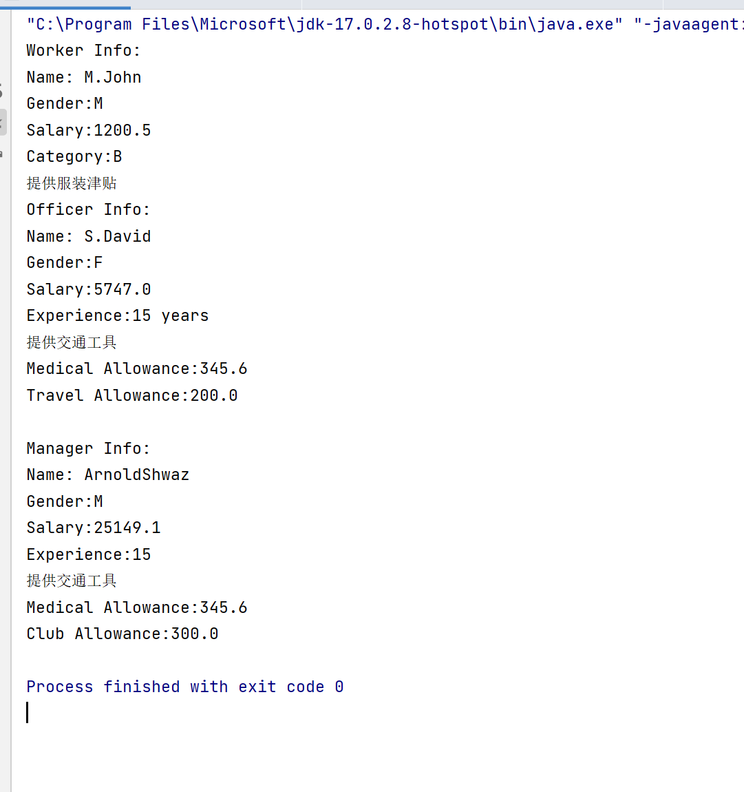
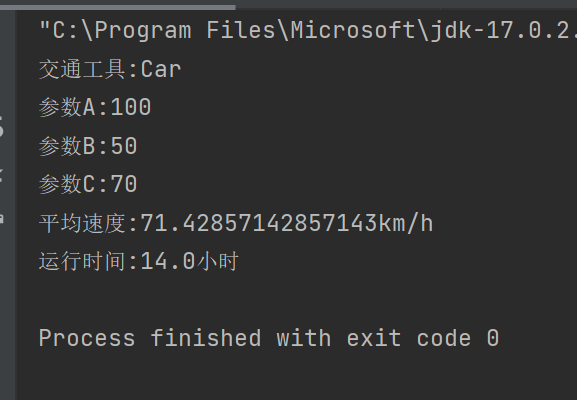
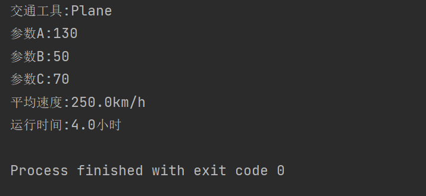
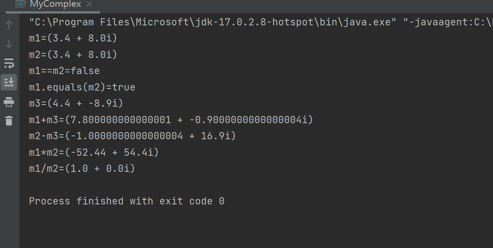
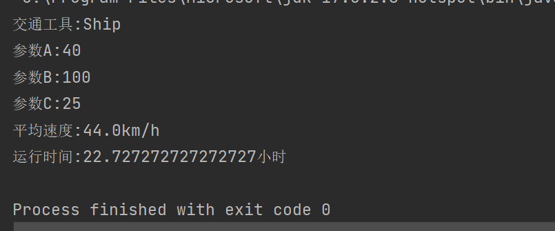

# 面向对象设计进阶实验报告

```
兰州大学信息科学与工程学院 徐宇奇 320190902531
```

## 第一部分

### 1.1 第一题

#### 1.1.1 请解释为什么"k=30;"语句编译会出错？

```
前面已经有了语句"static final int k=20;"，这里再次编译时会出错，因为"k"是终态常量，不能被修改。
```

#### 1.1.2 请解释为什么i的输出值不是15？

```
因为前面有了语句"static int i=10;"和"static {i=i+5};"，因为"i"是静态变量，所以在编译时会被初始化为10，而"i=i+5"是静态代码块，所以在编译时会优先被执行，故"i"的值不是15。
```

#### 1.1.3 请解释final关键字和static关键字的作用是什么？

```
final关键字是用来修饰类、方法、变量、构造器、接口、枚举等，表示这些元素不能被修改，而static关键字是用来修饰类、方法、变量、构造器、接口、枚举等，表示这些元素不能被修改，但是可以被继承。
当用final修饰一个类时，表明这个类不能被继承。也就是说，如果一个类你永远不会让他被继承，就可以用final进行修饰。final类中的成员变量可以根据需要设为final，但是要注意final类中的所有成员方法都会被隐式地指定为final方法。
对于一个final变量，如果是基本数据类型的变量，则其数值一旦在初始化之后便不能更改；如果是引用类型的变量，则在对其初始化之后便不能再让其指向另一个对象。
使用final方法的原因有两个。第一个原因是把方法锁定，以防任何继承类修改它的含义；第二个原因是效率。在早期的Java实现版本中，会将final方法转为内嵌调用。但是如果方法过于庞大，可能看不到内嵌调用带来的任何性能提升。在最近的Java版本中，不需要使用final方法进行这些优化了.
类中用static关键字修饰的代码块称为静态代码，反之没有用static关键字修饰的代码块称为实例代码块。
实例代码块会随着对象的创建而执行，即每个对象都会有自己的实例代码块，表现出来就是实例代码块的运行结果会影响当前对象的内容，并随着对象的销毁而消失(内存回收)；而静态代码块是当Java类加载到JVM内存中而执行的代码块，由于类的加载在JVM运行期间只会发生一次，所以静态代码块也只会执行一次。
因为静态代码块的主要作用是用来进行一些复杂的初始化工作，所以静态代码块跟随类存储在方法区的表现形式是静态代码块执行的结果存储在方法区，即初始化量存储在方法区并被线程共享。
类中用static关键字修饰的成员变量称为静态成员变量，因为static不能修饰局部变量(为什么？)，因此静态成员变量也能称为静态变量。静态变量跟代码块类似，在类加载到JVM内存中，JVM会把静态变量放入方法区并分配内存，也由线程共享。访问形式是：类名.静态成员名。
用static关键字修饰的方法称为静态方法，否则称为实例方法。通过类名.方法名调用，但需要注意静态方法可以直接调用类的静态变量和其他静态方法，不能直接调用成员变量和实例方法(除非通过对象调用)。
```

### 1.2 第二题

#### 1.2.1 读懂程序 完成继承层次图并填空

```
第一个空：Superior 工作经验 医疗津贴
第二个空：Officer 差旅津贴
```

#### 1.2.2 分析程序的执行流程并写出程序的执行结果

```Java
package lesson3;
abstract class Employee{
    String EmpName;
    char sex;
    double EmpSal;
    Employee(String en,char s,double es){
        EmpName=en;
        sex=s;
        EmpSal=es;
    }
    public String getName(){
        return EmpName;
    }
    public char getSex(){
        return sex;
    }
    public abstract double getSal ();
    public void setSal(int basSal){
        EmpSal=basSal;
    }
}
class Worker extends Employee{
    char category;
    boolean dressAllowance;
    Worker(String en,char s,double es,char c,boolean d){
        super(en,s,es);
        category=c;
        dressAllowance=d;
    }
    public char getCategory(){
        return category;
    }
    public boolean getDressAllowance(){
        return dressAllowance;
    }
    public double getSal(){
        return EmpSal;
    }
}
class Superior extends Employee{
    int experience;
    boolean vehicle;
    double medicalAllowance;
    Superior(String en,char s,double es,int e,boolean v,double ma){
        super(en,s,es);
        experience=e;
        vehicle=v;
        medicalAllowance=ma;
    }
    public int getExp(){
        return experience;
    }
    public boolean getVehicle(){
        return vehicle;
    }
    public double getMedicalAll(){
        return medicalAllowance;
    }
    public double getSal(){
        return EmpSal*4+1000+medicalAllowance;
    }
}
class Officer extends Superior{
    double travelAllowance;
    Officer(String en,char s,double es,int e,boolean v,double ma,double ta){
        super(en,s,es,e,v,ma);
        travelAllowance=ta;
    }
    public double getTravelAll(){
        return travelAllowance;
    }
    public double getSal(){
        return EmpSal*2+200+travelAllowance+medicalAllowance;
    }
}
class Manager extends Superior{
    double clubAllowance;
    Manager(String en,char s,double es,int e,boolean v,double ma,double ca){
        super(en,s,es,e,v,ma);
        clubAllowance=ca;
    }
    public double getClubAll(){
        return clubAllowance;
    }
    public double getSal(){
        return EmpSal*5+2000+clubAllowance+medicalAllowance;
    }
}
class InheDemo {
    public static void main(String[] args) {
        Worker w=new Worker("M.John",'M',1200.50,'B',true);
        System.out.println("Worker Info:");
        System.out.println("Name: "+w.getName());
        System.out.println("Gender:"+w.getSex());
        System.out.println("Salary:"+w.getSal());
        System.out.println("Category:"+w.getCategory());
        if(w.getDressAllowance()){
            System.out.println("提供服装津贴");
        }else{
            System.out.println("不提供服装津贴");
        }
        Officer o=new Officer("S.David",'F',2500.70,15,true,345.60,200);
        System.out.println("Officer Info:");
        System.out.println("Name: "+o.getName());
        System.out.println("Gender:"+o.getSex());
        System.out.println("Salary:"+o.getSal());
        System.out.println("Experience:"+o.getExp()+" years");
        if(o.getVehicle()){
            System.out.println("提供交通工具");
        }else {
            System.out.println("不提供交通工具");
        }
        System.out.println("Medical Allowance:"+o.getMedicalAll());
        System.out.println("Travel Allowance:"+o.getTravelAll());
        Manager m=new Manager("ArnoldShwaz",'M',4500.70,15,true,345.60,300);
        System.out.println("\nManager Info:");
        System.out.println("Name: "+m.getName());
        System.out.println("Gender:"+m.getSex());
        System.out.println("Salary:"+m.getSal());
        System.out.println("Experience:"+m.getExp());
        if(m.getVehicle()){
            System.out.println("提供交通工具");
        }else{
            System.out.println("不提供交通工具");
        }
        System.out.println("Medical Allowance:"+m.getMedicalAll());
        System.out.println("Club Allowance:"+m.getClubAll());
    }
}
```

运行结果如下：


### 1.3 第三题

#### 1.3.1 请解释“import www.horsefly.Trangle;“语句的作用：

```
导入 www.horsefly.Trangle类
```

#### 1.3.2 程序中“package www.horsefly;“语句的含义：

```
将www.horsefly包中的所有类和方法暴露给其他包使用
```

#### 1.3.3 编译后，Trangle.class 所在的路径：

```
C : \shiyan5\www.horsefly.Trangle.class
```

#### 1.3.4 请回答在Java中包名和操作系统的目录有什么关系？

```
包名就是相对目录名，是一一对应的
```

## 第二部分

### 2.2 第二题

运行结果如下：



## 第三部分

### 3.2 第二题

代码如下：

```Java
package lesson3;
public class MyComplex {
    private double real;
    private double imaginary;

    public MyComplex(double real, double imaginary) {
        this.real = real;
        this.imaginary = imaginary;
    }

    public double getReal() {
        return real;
    }

    public double getImaginary() {
        return imaginary;
    }

    public void setReal(double real) {
        this.real = real;
    }

    public void setImaginary(double imaginary) {
        this.imaginary = imaginary;
    }

    public String toString() {
        return "(" + real + " + " + imaginary + "i)";
    }

    public MyComplex add(MyComplex other) {
        return new MyComplex(real + other.real, imaginary + other.imaginary);
    }

    public MyComplex subtract(MyComplex other) {
        return new MyComplex(real - other.real, imaginary - other.imaginary);
    }

    public MyComplex multiply(MyComplex other) {
        return new MyComplex(real * other.real - imaginary * other.imaginary, real * other.imaginary + imaginary * other.real);
    }

    public MyComplex divide(MyComplex other) {
        return new MyComplex((real * other.real + imaginary * other.imaginary) / (other.real * other.real + other.imaginary * other.imaginary), (imaginary * other.real - real * other.imaginary) / (other.real * other.real + other.imaginary * other.imaginary));
    }
    public boolean equals(MyComplex other) {
        return (real == other.real && imaginary == other.imaginary);
    }
    public static void main(String[] args) {
        MyComplex m1=new MyComplex(3.4,8.0);
        MyComplex m2=new MyComplex(3.4,8.0);
        System.out.println("m1="+m1);
        System.out.println("m2="+m2);
        System.out.println("m1==m2="+(m1==m2));
        System.out.println("m1.equals(m2)="+m1.equals(m2));
        MyComplex m3=new MyComplex(4.4,-8.9);
        System.out.println("m3="+m3);
        MyComplex m4=m1.add(m3);
        MyComplex m5=m2.subtract(m3);
        MyComplex m6=m1.multiply(m2);
        MyComplex m7=m1.divide(m2);
        System.out.println("m1+m3="+m4);
        System.out.println("m2-m3="+m5);
        System.out.println("m1*m2="+m6);
        System.out.println("m1/m2="+m7);
    }
}
```

运行结果如下:


### 3.3 第三题

代码如下：

```Java
package lesson3.CalTime.vehicle;
import lesson3.CalTime.vehicle.Common;
public class Ship implements Common{
    public double runTimer(double a, double b,double c){
        return a+b/c;
    }
}
```

运行结果如下：

