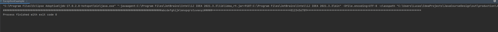
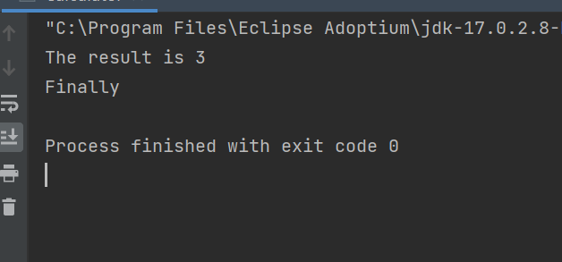

# 异常处理和部分常用类测试实验报告

```
兰州大学信息科学与工程学院 徐宇奇 320190902531
```

## 第一部分

### 1.2 第二题

#### 1.2.1 解释finally关键字的作用

```
finally关键字用于try后面，finally块中的代码总是执行，不论是否发生异常。一般用于清理工作、关闭链接等类型的语句。
```

#### 此程序中引发异常的语句是：

```Java
System.out.println("相除结果为：" + no1 / no2);
```

### 1.3 第三题

#### 1.3.1 用“java exception test "Abcde”“执行后的输出结果：

```
我自己定义的异常
我的异常信息
```

#### 1.3.2 用“java exception test "12345"“执行后的输出结果：

```
12345
```

## 第二部分

### 2.1 第一题

代码如下：

```Java
package lesson4;

//define an exception class
class NoLowerLetter extends Exception {
    public void print() {
        System.out.printf("%c", '#');
    }
}

class NoDigit extends Exception {
    public void print() {
        System.out.printf("%c", '*');
    }
}

class Test {
    void printLetter(char c) throws NoLowerLetter {
        if (c < 'a' || c > 'z') {
            NoLowerLetter noLowerLetter = new NoLowerLetter();
            throw noLowerLetter;
        } else {
            System.out.print(c);
        }
    }

    void printDigit(char c) throws NoDigit {
        if (c < '0' || c > '9') {
            NoDigit noDigit = new NoDigit();
            throw noDigit;
        } else {
            System.out.print(c);
        }
    }
}

public class ExceptionExample {
    public static void main(String[] args) {
        Test t = new Test();
        for (int i = 0; i < 128; i++) {
            try {
                t.printLetter((char) i);
            } catch (NoLowerLetter e) {
                e.print();
            }
        }
        for (int i = 0; i < 128; i++) {
            try {
                t.printDigit((char) i);
            } catch (NoDigit e) {
                e.print();
            }
        }
    }
}
```

运行结果如下：


## 第三部分

### 3.1 第一题

代码如下：

```Java
package lesson4;
import java.util.Scanner;
public class Calculator {
    public static void main(String[] args){
        int a = Integer.parseInt(args[0]);
        char op = args[1].charAt(0);
        int b = Integer.parseInt(args[2]);
        int result = 0;
        try{
            switch (op){
                case '+':
                    result = a + b;
                    break;
                case '-':
                    result = a - b;
                    break;
                case '*':
                    result = a * b;//在命令行输入乘号的时候，要加上双引号，否则会认为是通配符
                    break;
                case '/':
                    if(b==0) {
                        throw new ArithmeticException("Division by zero");
                    }
                    result = a / b;
                    break;
                default:
                    System.out.println("Error operator");
            }
        }catch (ArrayIndexOutOfBoundsException e){
            System.out.println("ArrayIndexOutOfBoundsException");
        }catch (NumberFormatException e){
            System.out.println("NumberFormatException");
        }catch(ArithmeticException e){
            System.out.println("Cannot divide by zero");
            System.out.println("Please enter a non-zero number");
            Scanner scanner = new Scanner(System.in);
            b = scanner.nextInt();
            result = a / b;

        }
        finally {
            System.out.println("The result is " + result);
            System.out.println("Finally");
        }
    }

}
```

运行结果如下：
