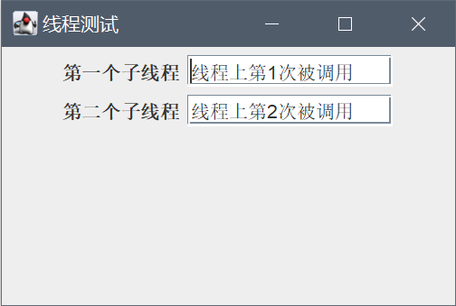
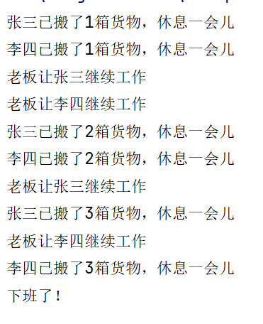
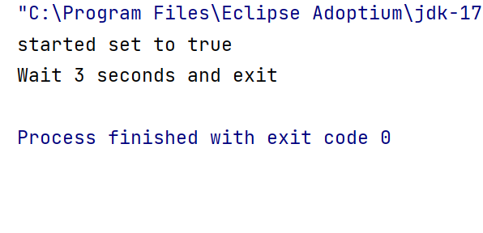
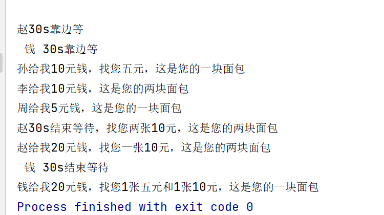
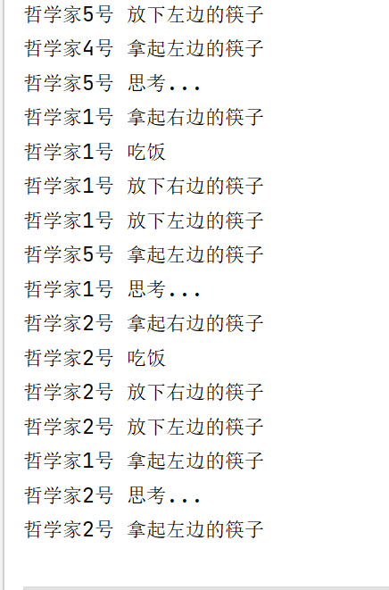

# 多线程程序设计基础

```
兰州大学信息科学与工程学院 2020级计算机科学与技术2班 徐宇奇 320190902531
```

## 1.11.3第一部分

### 1.1 第一题

2个线程

设置reptile1的名字为“Reptile1”

### 1.2第二题

结果截图如下：



Runnable的实现方式是实现其接口即可
Thread的实现方式是继承其类
Runnable接口支持多继承，但基本上用不到
Thread实现了Runnable接口并进行了扩展，而Thread和Runnable的实质是实现的关系，不是同类东西，所以Runnable或Thread本身没有可比性。

`Thread`类的 `currentThread()`方法用于返回对当前正在执行的线程对象的引用。

不能，sleep()是Thread类里面的方法

## 1.11.3 第二部分

### 2.2 第二题

```java
package lesson7;

class ShopWorker implements Runnable {
    static Thread zhangSan, liSi, boss;

    ShopWorker() {
        zhangSan = new Thread(this, "张三");
        liSi = new Thread(this, "李四");
        boss = new Thread(this, "老板");
    }

    public void run() {
        int i = 0;
        if (Thread.currentThread() == zhangSan) {
            while (true) {
                try {
                    i++;
                    System.out.println(Thread.currentThread().getName() + "已搬了" + i + "箱货物，休息一会儿");
                    if (i == 3) {
                        return;
                    }
                    zhangSan.sleep(10000);
                } catch (InterruptedException e) {
                    System.out.println(boss.getName() + "让" + Thread.currentThread().getName() + "继续工作");
                }
            }
        } else if (Thread.currentThread() == liSi) {
            while (true) {
                try {
                    i++;
                    System.out.println(Thread.currentThread().getName() + "已搬了" + i + "箱货物，休息一会儿");
                    if (i == 3) {
                        return;
                    }
                    liSi.sleep(10000);
                } catch (InterruptedException e) {
                    System.out.println(boss.getName() + "让" + Thread.currentThread().getName() + "继续工作");
                }
            }
        } else if (Thread.currentThread() == boss) {
            while (true) {
                //wake zhangsan and lisi
                zhangSan.interrupt();
                liSi.interrupt();
                if (!(zhangSan.isAlive() || liSi.isAlive())) {
                    System.out.println("下班了！");
                    return;
                }
            }
        }
    }
}

public class ShopWork {
    public static void main(String[] args) {
        ShopWorker shop = new ShopWorker();
        shop.zhangSan.start();
        shop.liSi.start();
        shop.boss.start();
    }
}

```

运行截图如下



## 1.12.3 第二部分

### 3.1 第一题

代码如下：

```java
package lesson7;

public class Consistent {
    static boolean started = false;

    public synchronized static void setStarted() {
        started = true;
    }

    public synchronized static boolean getStarted() {
        return started;
    }

    public static void main(String[] args) {
        Thread thread1 = new Thread(new Runnable() {
            public void run() {
                try {
                    Thread.sleep(3000);
                } catch (InterruptedException e) {
                }
                setStarted();
                System.out.println("started set to true");
            }
        });
        thread1.start();
        while (!getStarted()) {
        }
        System.out.println("Wait 3 seconds and exit");
    }
}
```

运行结果如下：



### 3.2 第二题

代码如下：

```java
package lesson7;

class BreadSeller {
    int fiveNum = 1, tenNum = 0, twentyNum = 0;

    public synchronized void sellBread(int receiveMoney, int buyNumber) {
        if (receiveMoney == 5) {
            fiveNum = fiveNum + 1;
            System.out.printf("\n%s给我5元钱，这是您的一块面包", Thread.currentThread().getName());
        } else if (receiveMoney == 10 && buyNumber == 2) {
            tenNum = tenNum + 1;
            System.out.printf("\n%s给我10元钱，这是您的两块面包", Thread.currentThread().getName());
        } else if (receiveMoney == 10 && buyNumber == 1) {
            while (fiveNum < 1) {
                try {
                    System.out.printf("\n %s 30s靠边等", Thread.currentThread().getName());
                    wait(30000);
                } catch (InterruptedException e) {
                }
            }
            fiveNum = fiveNum - 1;
            tenNum = tenNum + 1;
            System.out.printf("\n%s给我10元钱，找您五元，这是您的一块面包", Thread.currentThread().getName());
        } else if (receiveMoney == 20 && buyNumber == 1) {
            while ((fiveNum < 1 || tenNum < 1) && !(fiveNum > 3)) {
                try {
                    System.out.printf("\n %s 30s靠边等", Thread.currentThread().getName());
                    wait(30000);
                    System.out.printf("\n %s 30s结束等待", Thread.currentThread().getName());
                } catch (InterruptedException e) {
                }
            }
            if (fiveNum > 3) {
                fiveNum = fiveNum - 3;
                twentyNum = twentyNum + 1;
                System.out.printf("\n%s给我20元钱，找您三张五元，这是您的一块面包", Thread.currentThread().getName());
            } else {
                fiveNum = fiveNum - 1;
                tenNum = tenNum - 1;
                twentyNum = twentyNum + 1;
                System.out.printf("\n%s给我20元钱，找您1张五元和1张10元，这是您的一块面包", Thread.currentThread().getName());
            }
        } else if (receiveMoney == 20 && buyNumber == 2) {
            while (tenNum < 1 && fiveNum < 2) {
                try {
                    System.out.printf("\n%s30s靠边等", Thread.currentThread().getName());
                    wait(30000);
                    System.out.printf("\n%s30s结束等待，找您两张10元，这是您的两块面包", Thread.currentThread().getName());
                } catch (InterruptedException e) {
                }
            }
            if (fiveNum < 2) {
                tenNum = tenNum - 1;
                twentyNum = twentyNum + 1;
                System.out.printf("\n%s给我20元钱，找您一张10元，这是您的两块面包", Thread.currentThread().getName());
            } else {
                fiveNum = fiveNum - 2;
                twentyNum = twentyNum + 1;
                System.out.printf("\n%s给我20元钱，找您两张5元，这是您的两块面包", Thread.currentThread().getName());
            }
            notifyAll();//唤醒所有等待线程
        }
    }
}

class BreadShop implements Runnable {
    Thread zhao, qian, sun, li, zhou;
    BreadSeller seller;

    BreadShop() {
        zhao = new Thread(this);
        qian = new Thread(this);
        sun = new Thread(this);
        li = new Thread(this);
        zhou = new Thread(this);
        zhao.setName("赵");
        qian.setName("钱");
        sun.setName("孙");
        li.setName("李");
        zhou.setName("周");
        seller = new BreadSeller();
    }

    public void run() {
        if (Thread.currentThread() == zhao) {
            seller.sellBread(20, 2);
        } else if (Thread.currentThread() == qian) {
            seller.sellBread(20, 1);
        } else if (Thread.currentThread() == sun) {
            seller.sellBread(10, 1);
        } else if (Thread.currentThread() == li) {
            seller.sellBread(10, 2);
        } else if (Thread.currentThread() == zhou) {
            seller.sellBread(5, 1);
        }
    }
}

public class SaleExample {
    public static void main(String[] args) {
        BreadShop myshop = new BreadShop();
        myshop.zhao.start();
        try {
            Thread.sleep(1000);
        } catch (InterruptedException e) {
        }
        myshop.qian.start();
        try {
            Thread.sleep(1000);
        } catch (InterruptedException e) {
        }
        myshop.sun.start();
        try {
            Thread.sleep(1000);
        } catch (InterruptedException e) {
        }
        myshop.li.start();
        try {
            Thread.sleep(1000);
        } catch (InterruptedException e) {
        }
        myshop.zhou.start();
    }
}
```

运行结果如下：



## 1.12.3 第三部分

### 设计一个哲学家就餐问题：

利用**死锁避免**策略，那就是从逻辑上去避免死锁的发生，比如改变其中一个哲学家拿筷子的顺序。我们可以让 4 个哲学家都先拿左边的筷子再拿右边的筷子，但是 **有一名哲学家与他们相反，他是先拿右边的再拿左边的**
，这样一来就不会出现循环等待同一边筷子的情况，也就不会发生死锁了。

代码如下：

```java
package lesson7;
public class DiningPhilosophers {
    public static class Philosopher implements Runnable {
        private Object leftChopstick;
        private Object rightChopstick;
        public Philosopher(Object leftChopstick, Object rightChopstick) {
            this.leftChopstick = leftChopstick;
            this.rightChopstick = rightChopstick;
        }
        @Override
        public void run() {
            try {
                while (true) {
                    doAction("思考...");
                    synchronized (leftChopstick) {
                        doAction("拿起左边的筷子");
                        synchronized (rightChopstick) {
                            doAction("拿起右边的筷子");
                            doAction("吃饭");
                            doAction("放下右边的筷子");
                        }
                        doAction("放下左边的筷子");
                    }
                }
            } catch (InterruptedException e) {
                e.printStackTrace();
            }
        }
        private void doAction(String action) throws InterruptedException {
            System.out.println(Thread.currentThread().getName() + " " + action);
            Thread.sleep((long) (Math.random() * 10));
        }
    }
    public static void main(String[] args) {
        Philosopher[] philosophers = new Philosopher[5];
        Object[] chopsticks = new Object[philosophers.length];
        for (int i = 0; i < chopsticks.length; i++) {
            chopsticks[i] = new Object();
        }
        for (int i = 0; i < philosophers.length; i++) {
            Object leftChopstick = chopsticks[i];
            Object rightChopstick = chopsticks[(i + 1) % chopsticks.length];
            philosophers[i] = new Philosopher(rightChopstick, leftChopstick);
            new Thread(philosophers[i], "哲学家" + (i + 1) + "号").start();
        }
    }
}
```

运行结果如下：


