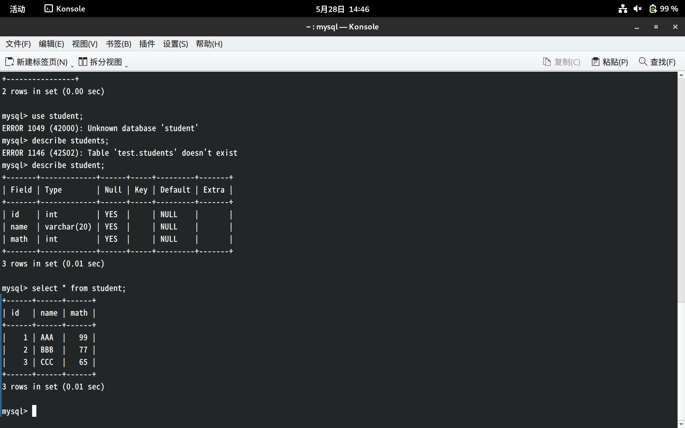
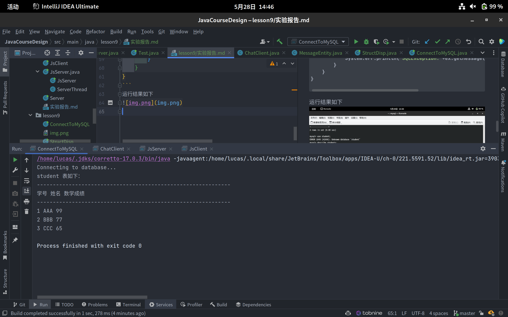
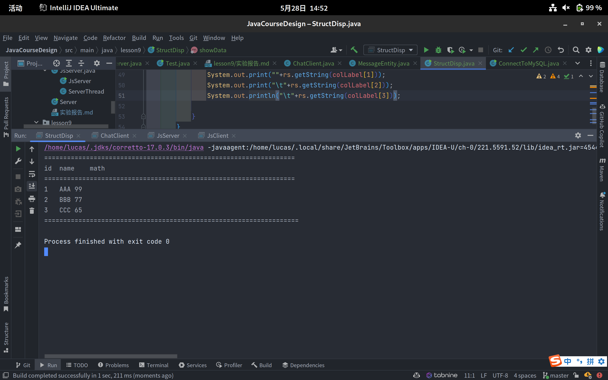
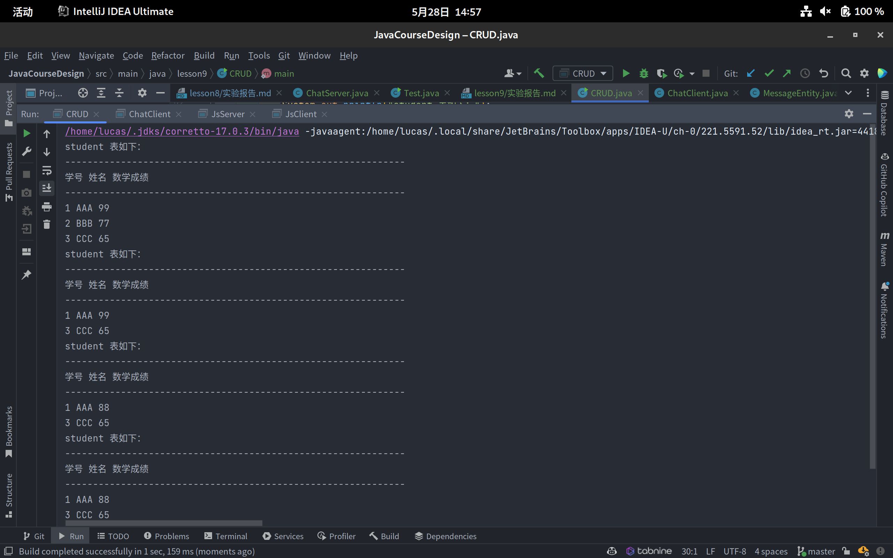

# 网络程序设计基础实验报告

```
兰州大学信息科学与工程学院 2020级计算机科学与技术2班 徐宇奇 320190902531 
```
## 第一部分
### 1.2 第二题
代码如下：
```Java
package lesson9;

import java.sql.*;


public class ConnectToMySQL {
    public static Connection getConnection()throws SQLException,java.lang.ClassNotFoundException{
        String url="jdbc:mysql://219.246.90.88:3306/test";
        Class.forName("com.mysql.cj.jdbc.Driver");
        String userName="lucas";
        String password="368611020Xyq....";
        Connection con= DriverManager.getConnection(url,userName,password);
        return con;
    }

    public static void main(String[] args) {
        try{

            Connection con=getConnection();
            Statement sql=con.createStatement();
            sql.execute("drop table if exists student");

            sql.execute("create table student(id int,name varchar(20),math int)");

            sql.execute("insert student values(1,'AAA','99')");
            sql.execute("insert student values(2,'BBB','77')");
            sql.execute("insert student values(3,'CCC','65')");

            String query="select * from student";
            ResultSet result=sql.executeQuery(query);
            System.out.println("student 表如下：");
            System.out.println("-------------------------------------------------------------");
            System.out.println("学号"+" "+"姓名"+" "+"数学成绩");
            System.out.println("-------------------------------------------------------------");
            int number;
            String name ;
            String math;
            while(result.next()){
                number=result.getInt("id");
                name=result.getString("name");
                math=result.getString("math");
                System.out.println(number+" "+name+" "+math);
            }
            sql.close();
            con.close();
        }catch (java.lang.ClassNotFoundException e){
            System.err.println("ClassNotFoundException:"+e.getMessage());
        }catch(SQLException ex){
            System.err.println("SQLException:"+ex.getMessage());
        }
    }
}
```
运行结果如下


## 第二部分
代码如下：
```Java
package lesson9;

import java.io.*;
import java.sql.*;

public class StructDisp {
    static String colLabel[];
    static int colCount;

    public static void main(String[] args) {
        try{
            Class.forName("com.mysql.jdbc.Driver");
        }catch (ClassNotFoundException e){
            System.out.println(e.getMessage());
        }
        try{
            String url="jdbc:mysql://219.246.90.88:3306/test";
            String userName="lucas";
            String password="368611020Xyq....";
            Connection con= DriverManager.getConnection(url,userName,password);
            Statement stm=con.createStatement();
            boolean status=stm.execute("select * from stu");
            ResultSet rs=stm.getResultSet();
            showStruct(rs);
            showData(rs);
            stm.close();
        }catch(SQLException e){
            System.out.println(e.getSQLState());
        }catch (IOException e2){
            System.out.println(e2.getMessage());
        }
    }
    public static void showStruct(ResultSet rs)throws IOException,SQLException{
        ResultSetMetaData md=rs.getMetaData();
        colCount=md.getColumnCount();
        colLabel=new String[colCount+1];
        System.out.println("==================================================================");
        for(int i=1;i<=colCount;i++){
            colLabel[i]=md.getColumnLabel(i);
            System.out.printf(""+colLabel[i]+"\t");

        }
        System.out.println("\n==================================================================");

    }
    public static void showData(ResultSet rs)throws IOException,SQLException{
        if(rs!=null){
            while(rs.next()){
                System.out.print(""+rs.getString(colLabel[1]));
                System.out.print("\t"+rs.getString(colLabel[2]));
                System.out.print("\t"+rs.getInt(colLabel[3]));
                System.out.println("\t"+rs.getInt(colLabel[4]));
            }
        }
        System.out.println("===================================================================");
    }
}
```
运行结果如下：


## 第三部分 CRUD程序
结果如下：

代码如下：
```Java
package lesson9;

import java.sql.*;

/**
 * a typical crud program
 */
public class CRUD {
    public static void main(String[] args) {
        try {
            Class.forName("com.mysql.cj.jdbc.Driver");
        } catch (ClassNotFoundException e) {
            System.out.println(e.getMessage());
        }
        try {
            String url = "jdbc:mysql://219.246.90.88:3306/test";
            String userName = "lucas";
            String password = "368611020Xyq....";
            Connection con = DriverManager.getConnection(url, userName, password);
            Statement sql = con.createStatement();
            sql.execute("drop table if exists student");
            sql.execute("create table student(id int,name varchar(20),math int)");
            sql.execute("insert student values(1,'AAA','99')");
            sql.execute("insert student values(2,'BBB','77')");
            sql.execute("insert student values(3,'CCC','65')");
            String query = "select * from student";
            ResultSet result = sql.executeQuery(query);
            System.out.println("student 表如下：");
            System.out.println("-------------------------------------------------------------");
            System.out.println("学号" + " " + "姓名" + " " + "数学成绩");
            System.out.println("-------------------------------------------------------------");
            int number;
            String name;
            String math;
            while (result.next()) {
                number = result.getInt("id");
                name = result.getString("name");
                math = result.getString("math");
                System.out.println(number + " " + name + " " + math);
            }
            //delete
            sql.execute("delete from student where id=2");
            sql.execute("select * from student");
            result = sql.executeQuery(query);
            System.out.println("student 表如下：");
            System.out.println("-------------------------------------------------------------");
            System.out.println("学号" + " " + "姓名" + " " + "数学成绩");
            System.out.println("-------------------------------------------------------------");
            while (result.next()) {
                number = result.getInt("id");
                name = result.getString("name");
                math = result.getString("math");
                System.out.println(number + " " + name + " " + math);
            }
            //change
            sql.execute("update student set math=88 where id=1");
            sql.execute("select * from student");
            result = sql.executeQuery(query);
            System.out.println("student 表如下：");
            System.out.println("-------------------------------------------------------------");
            System.out.println("学号" + " " + "姓名" + " " + "数学成绩");
            System.out.println("-------------------------------------------------------------");
            while (result.next()) {
                number = result.getInt("id");
                name = result.getString("name");
                math = result.getString("math");
                System.out.println(number + " " + name + " " + math);
            }
            //insert
            sql.execute("insert student values(4,'DDD','66')");
            sql.execute("select * from student");
            result = sql.executeQuery(query);
            System.out.println("student 表如下：");
            System.out.println("-------------------------------------------------------------");
            System.out.println("学号" + " " + "姓名" + " " + "数学成绩");
            System.out.println("-------------------------------------------------------------");
            while (result.next()) {
                number = result.getInt("id");
                name = result.getString("name");
                math = result.getString("math");
                System.out.println(number + " " + name + " " + math);
            }
            sql.close();
            con.close();
        } catch (SQLException e) {
            throw new RuntimeException(e);
        }
    }
}
```